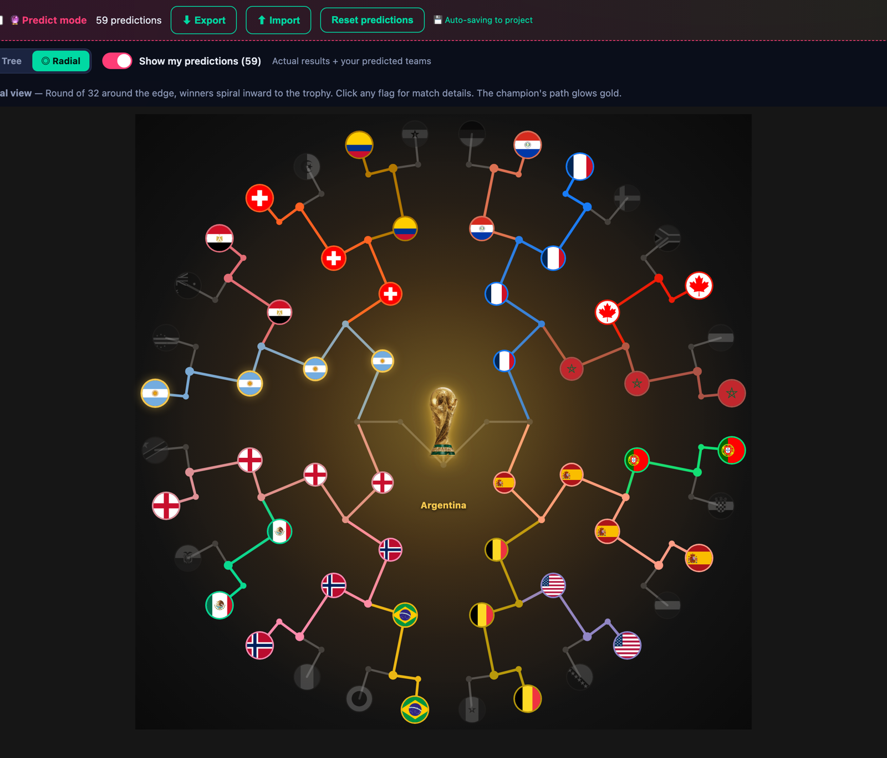
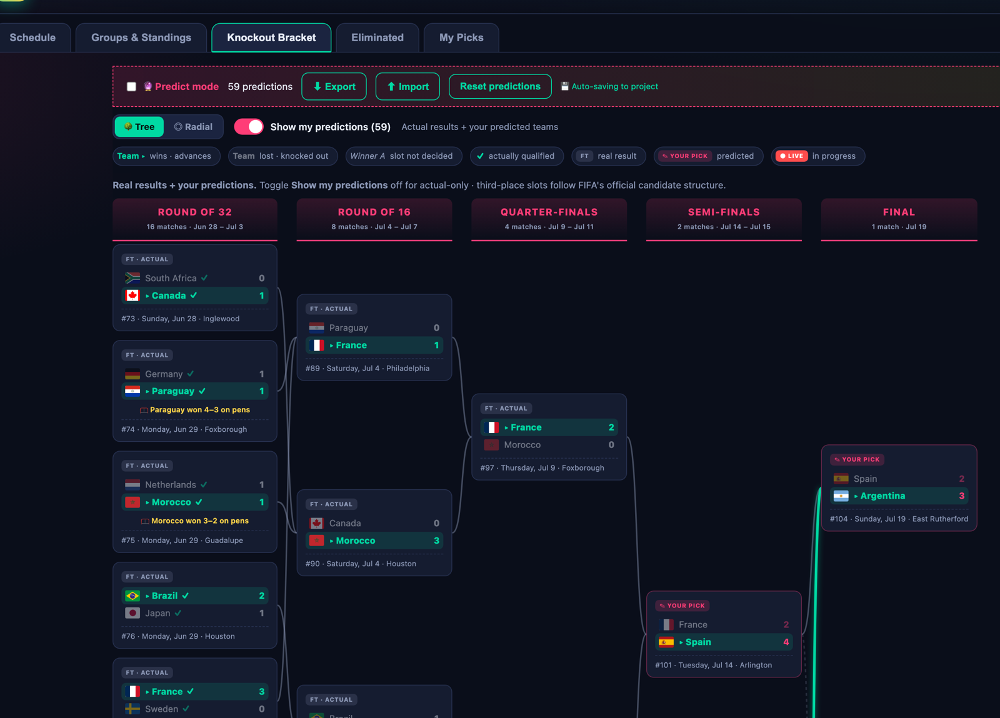
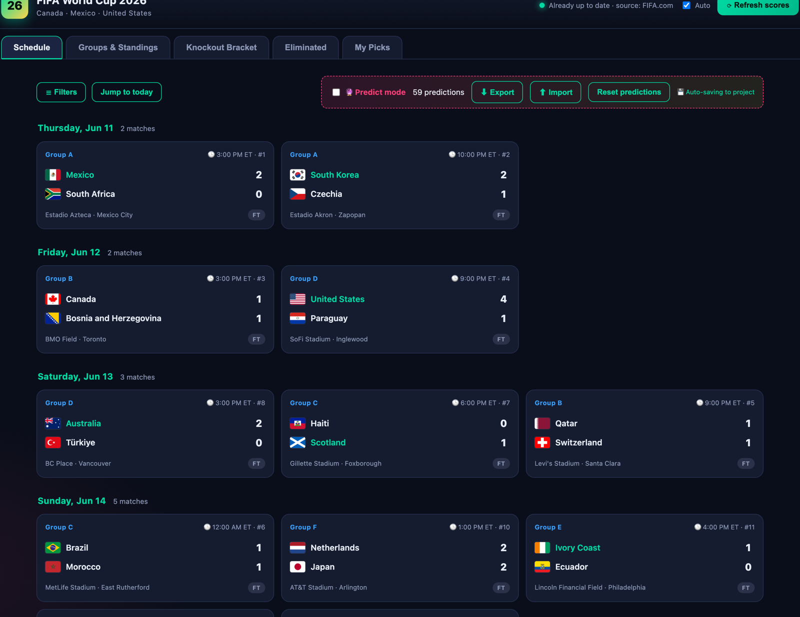

# FIFA World Cup 2026 — Interactive Schedule, Standings & Bracket

**▶ Live demo:** https://haidariaa.github.io/fifa-world-cup-2026/

A self-contained web app (plain HTML/CSS/JS — **no build step, no dependencies**) for the
2026 World Cup across Canada, Mexico & the USA. It ships with the full **104-match
schedule**, all **12 groups / 48 teams** (official draw), real results, live standings, an
interactive **knockout bracket** (tree *and* radial layouts), an **eliminated-teams** view,
a **predict mode**, and one-click **live score refresh** from FIFA's own data feed.

> Everything runs client-side from static files. The only optional server-side piece is a
> tiny Node static server that also persists your predictions into the project folder.

## Screenshots

**Radial knockout bracket** — 32 teams around the rim, each winner's flag tracing its
national colour inward to the trophy:



**Tree bracket** — Round of 32 → Final with real results and your predicted picks:



**Schedule** — every match grouped by day with flags, venues, scores and status:



---

## Table of contents

- [Features](#features)
- [Run it](#run-it)
- [Live data / refresh](#live-data--refresh)
- [How dates & times work (ET vs UTC)](#how-dates--times-work-et-vs-utc)
- [The knockout bracket (tree & radial)](#the-knockout-bracket-tree--radial)
- [Updating the bundled dataset](#updating-the-bundled-dataset)
- [Project layout](#project-layout)
- [Architecture notes (for future reference)](#architecture-notes-for-future-reference)
- [Notes & gotchas](#notes--gotchas)

---

## Features

- **Schedule** — every match grouped by day, with flags + country names, venues, kick-off
  times (ET), scores, and status (FT / scheduled / predicted). Filter by stage, group,
  team, or text search; "Upcoming only" and "Jump to today".
- **Live matches** — a match in progress turns its card red with a pulsing glow and shows
  the current minute (e.g. `67'`); a **● LIVE** badge appears on the Schedule tab. Live
  scores display everywhere but do **not** finalise standings/qualification or knockout
  winners until full time. Tick **Auto** to keep the clock and scores ticking (60s).
- **Groups & Standings** — all 12 group tables (P/W/D/L/GF/GA/GD/Pts + last-5 form),
  recomputed live with FIFA tiebreakers (points → GD → GF → head-to-head). Top-2 and
  best-third positions are highlighted.
- **Knockout Bracket** — Round of 32 → Final, plus 3rd-place play-off and champion, in two
  switchable layouts:
  - 🌳 **Tree** — classic left-to-right bracket with score/pick tags per box.
  - ◎ **Radial** — 32 teams around the rim spiralling inward to the trophy; each advancing
    team's flag sits on the junction node it reached, with its national colour tracing the
    path. Click any flag or the trophy for match details.
  - Slots auto-fill from group results; winners propagate round to round. Toggle **Show my
    predictions** to view actual-only vs actual + your picks.
- **Eliminated** — every country that's out, with the reason (group exit or which round
  they lost). Click a card to see that team's full match-by-match path.
- **My Picks** — a scorecard grading your predictions as each match finishes: 🟢 **Exact**
  (3 pts), 🟡 **Right result** — correct win/draw/loss even if the score differed (1 pt),
  🔴 **Miss** (0). Shows an accuracy donut, points total, per-match pick-vs-actual rows,
  and a Pending list. Real results always override predictions.
- **Predict mode** 🔮 — enter your own scores for any future match. Standings, the bracket
  (with penalty-winner picks for draws) and the eliminated list all recompute instantly.
  Predictions are saved in your browser (localStorage); "Reset predictions" clears them.
  **Export / Import** your predictions as a JSON file to back them up or move them between
  browsers, machines, or ports.
- **Live refresh** — pulls real scores from **FIFA.com's own data feed**
  (`api.fifa.com/v3`, competition 17 / season 285023), with
  [TheSportsDB](https://www.thesportsdb.com) as automatic fallback. Manual button + optional
  60-second auto-refresh.

---

## Run it

**Recommended — Node server (auto-saves predictions into the project):**

```bash
node server.js
# then open http://localhost:8000
```

This serves the app *and* writes your predictions to `data/predictions.json` in the
project on every change (and loads them on startup), so your progress lives in a project
file, not just the browser. The predict bar shows "💾 auto-saving to project" when active.

**Or any static server (predictions then live only in browser localStorage):**

```bash
python3 -m http.server 8000      # built in on macOS
# …or
npx serve .
```

> Opening `index.html` via `file://` mostly works too, but a local server is recommended
> so flags, the live API, and saved predictions behave consistently. The app auto-detects
> whether the Node backend is present and falls back to localStorage if not.

No `npm install` — there are **no runtime dependencies**. `server.js` uses only Node's
built-in `http`/`fs`/`path`.

---

## Live data / refresh

- The **Refresh scores** button (top-right) calls FIFA's data API directly from the
  browser (it sends `Access-Control-Allow-Origin: *`, so no proxy or key is needed). It
  normalises team names (e.g. *Korea Republic → South Korea*, *Czech Republic → Czechia*)
  and merges scores into the schedule, standings and bracket. Tick **Auto** for 60s polling.
- **Source order:** FIFA primary → TheSportsDB fallback → bundled data. FIFA's feed is
  unofficial/undocumented and behind Akamai bot protection, so if it throttles, the app
  transparently falls back to TheSportsDB, then to the bundled results. The status line
  shows which source the latest refresh used.
- **Two merge paths** (both in [js/api.js](js/api.js)):
  - `mergeNormalized()` — group-stage fixtures, matched by team-name pair.
  - `mergeKnockout()` — knockout fixtures, matched by **slot signature**. Group-position
    slots (`1A`, `2B`, `3(...)`) *and* winner/loser feeders (`W74`, `L101`, and FIFA's
    `RU101`) are recognised via `koMatchSig()`, so results merge for **every** round from
    Round of 32 through the Final — not just the R32.
- Configure or swap providers in [js/api.js](js/api.js): `WC.api.config` (FIFA competition/
  season ids, or set `provider`), plus `providerFifa()` / `providerSdb()` and their
  normalisers. Everything downstream is provider-agnostic.

> **Important:** the live refresh updates scores, real teams and penalty winners **in
> memory only** — it does not rewrite the bundled dataset. Each load starts from the bundle
> and re-fetches. So the bundle can lag reality until a refresh lands; if FIFA throttles,
> unplayed slots fall back to your predictions.

---

## How dates & times work (ET vs UTC)

**All kick-off dates and times in the app are US Eastern Time (ET)** — the tournament is
hosted in North America and the UI states this explicitly.

This matters when comparing against the FIFA feed, which reports fixture dates in **UTC**.
A late-evening ET kickoff (e.g. 9:00 PM ET) is already past midnight UTC, so FIFA lists it
on the *next* calendar day. The bundled dataset intentionally keeps the **ET date**, so a
handful of night matches will show one day earlier here than in a UTC source. This is
correct for an ET-based app — do **not** "fix" it by syncing dates to the feed.

`WC.todayISO()` uses the viewer's local clock, so the **TODAY** pill and "Jump to today"
follow the machine's date. If the current day has no fixtures, the schedule scrolls to the
next matchday instead of showing a pill.

---

## The knockout bracket (tree & radial)

- Both layouts read the **same** resolved bracket model (`bracketM()` in
  [js/app.js](js/app.js)), so they never disagree; only the drawing differs.
- **Radial specifics** — a team that keeps winning appears once per round it won, each flag
  positioned on the junction node that round reached (rim → R32 → R16 → QF → SF → centre).
  Clicking a flag opens *that round's* match (e.g. the innermost Argentina flag is its QF,
  not its R16). The trophy at the centre opens the Final. Flag `z-index` is kept above the
  centre element so inner flags near the trophy remain individually clickable.
- Only **real, finished** results colour a path; predicted-only advances stay grey unless
  "Show my predictions" adds them.

---

## Updating the bundled dataset

Fixtures, venues and the results baked in at build time live in compact arrays in
[tools/generate-data.js](tools/generate-data.js). Edit there and regenerate:

```bash
node tools/generate-data.js   # rewrites data/worldcup2026.js
```

The generator is the source of truth for the **structure** (slots, feeders, venues, dates).
For live results you normally rely on the in-app **Refresh** rather than re-baking, but you
can hard-code newer scores in the generator's arrays if you want them present without a
network call.

---

## Project layout

```
index.html              # shell + tabs (Schedule / Groups / Bracket / Eliminated / My Picks)
styles.css              # all styling (dark WC26 theme; tree + radial bracket)
server.js               # Node static server + predictions auto-save API (optional)
data/worldcup2026.js    # generated dataset -> window.WC_DATA
data/teamfacts.js       # per-team World Cup history/pedigree -> window.WC_FACTS
data/predictions.example.json  # empty template; copy to predictions.json to start
data/predictions.json   # your local picks (git-ignored; created/updated by server.js)
tools/generate-data.js  # source of truth for fixtures/structure; regenerates the dataset
js/util.js              # flags, country names, date/time formatting, todayISO
js/standings.js         # group standings engine (real + predicted)
js/bracket.js           # knockout slot resolution + winner propagation
js/api.js               # live score refresh + name normaliser (FIFA + TheSportsDB)
js/app.js               # state, views, filters, predict mode, radial/tree render, modal, store
```

---

## Architecture notes (for future reference)

- **No framework, no bundler.** Modules attach to a global `WC` namespace via IIFEs
  (`(function (WC) { … })(window.WC)`). Load order in `index.html` matters:
  data → util → standings → bracket → api → app.
- **Two score lenses** drive most views:
  - *Projected* (`projScore` / `projBracketScore`) — real result if present, else your
    prediction. Used by the bracket when "Show my predictions" is on, and by live standings.
  - *Actual-only* (`realScore` / `realBracketScore`) — real results only; everything else
    stays TBD. Used when predictions are toggled off.
- **`recompute()`** in `app.js` rebuilds one `MODEL` object (standings, projected bracket,
  actual bracket, eliminated, qualified) that every tab renders from.
- **Bracket resolution** (`js/bracket.js`) turns slot labels into teams: group-position
  slots resolve from standings; `W##`/`L##` feeders resolve from earlier matches' winners/
  losers; `koSlotReal` (built from the FIFA feed) can pin official pairings early.
- **Predictions** are `{ predictions: {matchId: {hs, as}}, koWinners: {matchId: team} }`.
  Real results/penalty winners always take precedence over a stale pick.
- **Persistence**: browser `localStorage` always; plus, when `server.js` is serving,
  debounced POSTs to `/api/predictions` mirror them into `data/predictions.json`.

---

## Notes & gotchas

- Kick-off times/dates are **US Eastern Time (ET)** — see the ET-vs-UTC section above.
- Knockout **third-place pairings** show their candidate groups until FIFA's third-place
  allocation is determined; winner/runner-up slots resolve automatically once a group is
  mathematically complete.
- The bundled dataset is a **snapshot**; use **Refresh** (or re-run the generator) for
  anything newer. If the live providers are unreachable, played-but-unbundled matches show
  your predictions rather than real scores.
- Predictions in `data/predictions.json` are personal progress, not app config — safe to
  delete/reset; the app recreates it on the next save. The file is **git-ignored**; a blank
  `data/predictions.example.json` ships as the template.

---

## License

Released under the [MIT License](LICENSE) — free to use, modify, and distribute.
